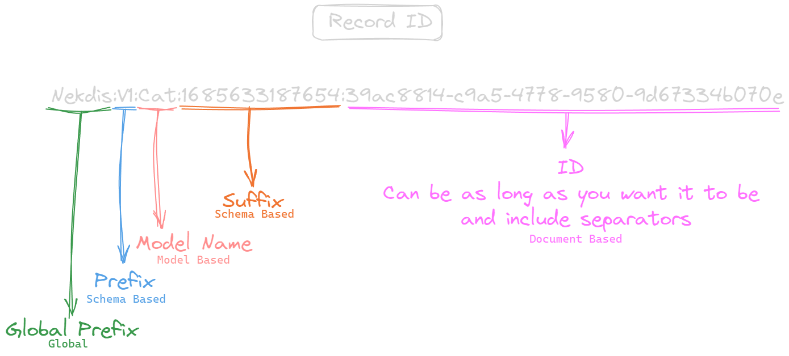

# Nekdis

Nekdis is a [Redis](https://redis.com/) ODM and mainly a proposal for [redis-om](https://github.com/redis/redis-om-node) that aims to improve the user experience and performance.

# Table of contents

- [Nekdis](#nekdis)
- [Table of contents](#table-of-contents)
- [Installation](#installation)
- [Getting Started](#getting-started)
  - [Connecting to the database](#connecting-to-the-database)
  - [Creating a Schema](#creating-a-schema)
  - [Creating a Model](#creating-a-model)
  - [Creating a document/record](#creating-a-documentrecord)
- [Glossary](#glossary)
  - [RecordID](#recordid)
  - [Document](#document)
  - [Reference](#reference)
  - [Relation](#relation)
- [Advanced concepts](#advanced-concepts)
  - [Self managed instance](#self-managed-instance)
    - [Option 1](#option-1)
    - [Option 2](#option-2)
  - [Vector similarity search](#vector-similarity-search)
    - [Pure queries](#pure-queries)
    - [Hybrid queries](#hybrid-queries)
    - [Range queries](#range-queries)
  - [Multiple value queries (`or` queries)](#multiple-value-queries-or-queries)
  - [Relational concepts](#relational-concepts)
    - [Using references](#using-references)
    - [Using relations](#using-relations)
  - [References VS Relations](#references-vs-relations)
    - [What is a Reference](#what-is-a-reference)
      - [The problem](#the-problem)
    - [What is a relation](#what-is-a-relation)
      - [The problem](#the-problem-1)
    - [Pros and Cons](#pros-and-cons)
    - [When to and not to use relations](#when-to-and-not-to-use-relations)
  - [Modularity with client modules](#modularity-with-client-modules)
  - [Modularity with base injections](#modularity-with-base-injections)
- [Schema field list](#schema-field-list)
- [Nekdis VS Redis-OM](#nekdis-vs-redis-om)
  - [Client](#client)
  - [Schema](#schema)
  - [Model vs Repository](#model-vs-repository)
    - [Nekdis Document](#nekdis-document)
      - [Creating and saving](#creating-and-saving)
      - [Creating and mutating](#creating-and-mutating)
  - [Search](#search)
  - [Nested objects](#nested-objects)
  - [A Simple example](#a-simple-example)
  - [Benchmarks](#benchmarks)

# Installation

Nekdis is available on the npm registry and can be installed with your preferred package manager

```sh
pnpm i nekdis
```

# Getting Started

## Connecting to the database

Nekdis already exports a global client but you can also create your own instance with the `Client` class.

```ts
import { client } from "nekdis";

await client.connect().then(() => {
    console.log("Connected to redis");
});
```

## Creating a Schema

Schemas are what defines the shape of your data and can be created using the `schema` method of the client.

```ts
const catSchema = client.schema({
    name: { type: "string" }
});
```

## Creating a Model

Models are what you use to interact with the database and collections that have the shape of the schema you pass in. They can be crated using the `model` method of the client.

```ts
const catModel = client.model("Cat", catSchema);
```

## Creating a document/record

The model provides some methods to handle your documents but the simplest way to create one is to do as follows:

```ts
const aCat = catModel.createAndSave({
    name: "Nozomi"
});
```

# Glossary

Nekdis does naming a little different than redis does and here is a short explanation of some of them.

## RecordID

Nekdis introduces the concept of the `RecordID` which is as highly customizable id that is divided into pieces, in redis itself this is just the `key`. So when you see documentation talking about an `id` or you read the types and you see `id` remember that it is just a redis `key` and shorthand for a `RecordID` in Nekdis.

The structure of a `RecordID` is as follows:


## Document

A document in Nekdis is just the data within a key plus the id and its parts.
The id parts can be accessed with `$globalPrefix`, `$prefix`, `$modelName`, `$suffix`, `$id` and `$recordId` respectively.

## Reference

A `reference` in nekdis is nothing more nothing less than a foreign key, so when you defined a field in your schema as being a `reference` you are just saying that a field contains one or more keys.

## Relation

A `relation` is a bit more complex than a relation since it is "virtual" and not part of the document.
For more details you can check the [references versus relations](#references-vs-relations) section on the readme.

# Advanced concepts

Here im going to explain a bit more of the possibilities of Nekdis.

## Self managed instance

Nekdis allows you to pass your own redis client to it, this allows a higher degree of control over the connection and some freedom.

### Option 1

```ts
import { client } from "./src";
import { createClient } from "redis";

client.redisClient = createClient();
```

### Option 2

```ts
import { Client } from "./src";
import { createClient } from "redis";

const client = new Client({}, createClient());
```

## Vector similarity search

Redis supports indexing vectors on the database for search, with this in mind we built a way to query them that resembles the point search using the same builder pattern.

There are plans to add more functionality to it in the future but for now using it is really simple.

### Pure queries

```ts
testModel.search().where("vec").eq((vector) => vector
    .knn()
    .from(new Float32Array([0.1, 0.1]))
    .return(8))
.returnAll();
// Generates the following query
// "*=>[KNN 8 @vec $BLOB]" "PARAMS" "2" "BLOB" "\xcd\xcc\xcc=\xcd\xcc\xcc=" "DIALECT" "2"
```

### Hybrid queries

```ts
testModel.search().where("age").between(18, 30)
    .and("vec").eq((vector) => vector
        .knn()
        .from(new Float32Array([0.1, 0.1]))
        .return(8))
    .returnAll();
// Generates the following query
// "((@age:[18 30])) =>[KNN 8 @vec $BLOB]" "PARAMS" "2" "BLOB" "\xcd\xcc\xcc=\xcd\xcc\xcc=" "DIALECT" "2"
```

### Range queries

```ts
testModel.search().where("vec").eq((vector) => vector
    .range(5)
    .from(new Float32Array([0.1, 0.1])))
.returnAll();
// Generates the following query
// "((@vec:[VECTOR_RANGE 5 $BLOB])) " "PARAMS" "2" "BLOB" "\xcd\xcc\xcc=\xcd\xcc\xcc=" "DIALECT" "2"
```

## Multiple value queries (`or` queries)

In Nekdis you can pass in an array of values to `eq`/`equals`/`equalsTo` to make an "or query". Another alias for it is `includes`.

> **NOTE**
> This only works on `TAG` (excluding boolean) and `TEXT` fields for now

```ts
const UserSchema = client.schema({
    name: { type: "text", index: true }
})

const UserModel = client.model("User", UserSchema);

// Return all users with name `DidaS` or `Leibale`
await UserModel.search().where("name").eq(["DidaS", "Leibale"]).returnAll();
```

## Relational concepts

Due to some design limitations all relational concepts within nekdis, be it references or relations, are many-to-many, you can still do one-to-many and many-to-one relations with this but there are no constrains to do it explicitly meaning that you could on accident add another relation. With that also comes the disadvantage of not being able to optimize queries for those cases.

There are plans to introduce explicitly one-to-many and many-to-one **relations** but this change would not affect references and the default/implicit type would be many-to-many.

### Using references

As references are only foreign keys you can mix and match it with RediSearch to have functionality close to SQL, the problem however is that you will probably end up with non-atomic actions which may cause unwanted behavior down the line.

```ts
const UserSchema = client.schema({
    name: { type: "text", index: true },
    friends: { type: "reference", schema: "self" }
})

const UserModel = client.model("User", UserSchema);
await UserModel.createIndex();

const user1 = UserModel.create({
    name: "DidaS"
});

const user2 = UserModel.create({
    name: "Niek",
    friends: new ReferenceArray().reference(user1)
})

await UserModel.save(user1);
await UserModel.save(user2);

// Getting all the references
await UserModel.get(user2.$recordId, { withReferences: true });
/*
JSONDocument {
    name: 'Niek',
    friends: [ JSONDocument { name: 'DidaS', friends: ReferenceArray(0) [] } ]
}
*/

// Searching and returning the array of keys (just normal search)
await UserModel.search().where("name").eq("Niek").returnFirst();
/*
JSONDocument {
    name: 'Niek',
    friends: ReferenceArray(1) [
    'Nekdis:V1:User:028af7e1-11b0-4239-a51d-351564eef5bf'
    ]
}
*/

// Searching and returning the references
await UserModel.search().where("name").eq("Niek").returnFirst(true);
/*
JSONDocument {
    name: 'Niek',
    friends: [ JSONDocument { name: 'DidaS', friends: ReferenceArray(0) [] } ]
}
*/
```

### Using relations

Relations provide a more robust api but as of now there is no way to auto fetch relations when using `search` so you can only auto fetch relations when using `get`, this will change and the search methods will have the same api as `get` in the future.

```ts
const UserSchema = client.schema({
    name: { type: "text", index: true },
    friends: { type: "relation", schema: "self", meta: { age: "number" } }
})

const UserModel = client.model("User", UserSchema);
await UserModel.createIndex();

const user1 = UserModel.create({
    name: "DidaS"
});

const user2 = UserModel.create({
    name: "Niek"
})

const user3 = UserModel.create({
    name: "Otis"
})

await UserModel.save(user1);
await UserModel.save(user2);
await UserModel.save(user3);

await UserModel.relate(user2).to(user1).as("friends").with({ age: 19 }).exec();
await UserModel.relate(user2).to(user3).as("friends").exec();

// Getting all the relations
await UserModel.get(user2.$recordId, { withRelations: true });
/*
JSONDocument {
    name: 'Niek',
    friends: [ JSONDocument { name: 'Otis' }, JSONDocument { name: 'DidaS' } ]
}
*/

// Getting all the relations metadata
await UserModel.get(user2.$recordId, { withRelations: true, returnMetadataOverRelation: true });
/*
JSONDocument {
    name: 'Niek',
    friends: [
    JSONDocument {
        age: undefined,
        in: 'Nekdis:V1:User:c59e67d5-69f7-4746-8476-2354b5113069',
        out: 'Nekdis:V1:User:35c49ab7-112f-4938-aff7-a4e8374513df'
    },
    JSONDocument {
        age: 19,
        in: 'Nekdis:V1:User:c59e67d5-69f7-4746-8476-2354b5113069',
        out: 'Nekdis:V1:User:a92df323-a6c2-4576-bd11-21565db48331'
    }
    ]
}
*/

// Search on the relation metadata
await UserModel.get(user2.$recordId, {
    withRelations: true,
    relationsConstrain: {
        // Lets only search user friends related to the user in question
        friends: (s) => s.where("in").eq(UserModel.sanitize(user2.$recordId)).and("age").eq(19)
    }
});
/*
JSONDocument {
    name: 'Niek',
    friends: [ JSONDocument { name: 'DidaS' } ]
}
*/
```

## References VS Relations

In this section i hope to explain a little bit more about the differences between this two methods of creation some sort of relationship between documents.

### What is a Reference

References are a pretty simple concept, they are pretty much an array of foreign keys, you can store keys in a field of a document as a form of saying "x keys is related in y form to this document".

#### The problem

While Nekdis provides a way to auto fetch this relations, meaning it will fetch the keys and append them to the field as an array, this **is not Atomic** which can lead to some problems.
While this could be made atomic it would be somewhat of a breaking that im not sure its worth to make specially because relations exist.

### What is a relation

A relation as the name implies is a way to relate documents to each other, they work somewhat like graph relations and were inspired by the way [SurrealDB](https://surrealdb.com/) does relations.

#### The problem

Relations are expensive to run given redis runs on memory, this is because a lot of work and what we call omitted documents have to be created on the background for everything to work.

### Pros and Cons

| Type      | Is Atomic | Requires Lua | Works in redis-cli | Heavy on memory | Searchable | Allows Metadata |
| --------- | :-------: | :----------: | :----------------: | :-------------: | :--------: | :-------------: |
| Reference |     ❌     |      ❌       |         ❌          |        ❌        |     ❌      |        ❌        |
| Relation  |     ✔️     |      ✔️       |         ✔️          |        ✔️        |     ✔️      |        ✔️        |

### When to and not to use relations

While relations provide an amazing api they are expensive on ram specially at scale, im not here to say not to use them but to be aware of the drawbacks and requirements before doing so.

References are yes way more limiting than relations as of now but you can still map a lot of relationships with them if you use them properly.

## Modularity with client modules

Nekdis allows you to add your own modules to the client, this allows easier access to the raw node-redis client and a way to export all your higher functions in one go.

However there was a slight problem if you will regarding implementing this in a way that the types would still work, thats why instead of passing them to the constructor we provide a `withModules` method so even in javascript you can have intellisense on your modules.

```ts
import { type Client, client } from "nekdis";

class MyModule {
    constructor(client: Client) {
        // Do something
    }

    myFunction() {
        // Do something
    }
}

client.withModules({ name: "myMod", ctor: MyModule });

// Access it
client.myMod.myFunction()
```

## Modularity with base injections

Nekdis provides a way to set bases to your schemas, this means that you can have "global" definitions, methods and options that will be applied to every schema you create.

This is pretty useful specially when creating methods that you want to have across all your models.

A good example of this can be found [<u>here</u>](./examples/table-module.ts).

# Schema field list

| Type        | String Notation | Literal value support | Sortable | Index type |
| ----------- | :-------------: | :-------------------: | :------: | :--------: |
| `string`    |        ✔️        |           ✔️           |    ✔️     |   `TAG`    |
| `number`    |        ✔️        |           ✔️           |    ✔️     | `NUMERIC`  |
| `bigint`    |        ✔️        |           ✔️           |    ✔️     |   `TAG`    |
| `boolean`   |        ✔️        |           ❌           |    ✔️     |   `TAG`    |
| `text`      |        ✔️        |           ❌           |    ✔️     |   `TEXT`   |
| `date`      |        ✔️        |           ❌           |    ✔️     | `NUMERIC`  |
| `point`     |        ✔️        |           ❌           |    ✔️     |   `GEO`    |
| `vector`    |        ✔️        |           ❌           |    ❌     |  `VECTOR`  |
| `array`     |        ✔️        |           ❌           |    ❌     |     -      |
| `tuple`     |        ❌        |           ❌           |    ❌     |     -      |
| `object`    |        ❌        |           ❌           |    ❌     |     -      |
| `reference` |        ❌        |           ❌           |    ❌     |     -      |
| `relation`  |        ❌        |           ❌           |    ❌     |     -      |

To check the extra options for each field, refer to the [types](./src/typings/schema-and-fields-definition.ts).

# Nekdis VS Redis-OM

In this part of the document im going to cover how this proposal compares to the current redis-om (0.4.2) and the major differences.

## Client

In Nekdis the `Client` does not provide any methods to interact directly with the database and its pretty much only used to store your models and handle the connection, **however** you can access the `node-redis` client by accessing `client.raw`.

## Schema

The schema in Nekdis is just where you define the shape of your data while in redis-om it also takes care of creating indexes and some other internal bits.

With this comes the big question "Well, why not use just a plain object then", the simple answer to this question is ease of use but to explain it further, having the schema defined this way allows the library to internally check if there isn't anything missing and parse it so you are allowed to use the shorthand methods like `field: "string"`, this approach also allows for you to define methods an options that will be passed down to the model down the road and not to mention that this is one of the only ways to have references working properly without affecting performance.

## Model vs Repository

In redis-om you use a `repository` to interact with the db by using methods like `fetch`, `save` and `search`.

In Nekdis the `model` is not that different but it allows you to add more functionality to it (see: [Custom Methods](#custom-methods)) and overall gives more functionality out of the box.

### Nekdis Document

In Nekdis you have what are called documents, this is just an abstraction to the data to allow better interaction with references and faster parsing.

At first this might look daunting compared to redis-om that now uses plain objects but i can assure you that there isn't that much of a difference, and i will give some examples to demonstrate it.

#### Creating and saving

See, its just as easy

<table>
<tr>
<th>Nekdis</th>
<th>Redis-OM</th>
</tr>
<tr>
<td>

```ts
await model.createAndSave({
    name: "DidaS"
});
```

</td>
<td>

```ts
await repository.save({
    name: "DidaS"
});
```

</td>
</tr>
</table>

#### Creating and mutating

This is where things start to be a bit different, even tho you **can** use a plain object that isn't recommended since it would just use more memory.

<table>
<tr>
<th>Nekdis</th>
<th>Nekdis with plain object</th>
<th>Redis-OM</th>
</tr>
<tr>
<td>

```ts
// You can pass values directly to it
// just like in createAndSave
const data = model.create({
    name: "DidaS"
});

// mutate data
data.year = 2023;

await model.save(data);
```

</td>
<td>

```ts
// Doing it this way will use more memory
// and you wont have intellisense
const data = {
    name: "DidaS"
}

// mutate data
data.year = 2023;

await model.createAndSave(data);
```

</td>
<td>

```ts
const data = {
    name: "DidaS"
}

// mutate data
data.year = 2023;

await repository.save(data);
```

</td>
</tr>
</table>

## Search

Looking at search for the first time it is pretty much the same, the only difference is that `equals` operations exist in **every** data type so a lot of times changing the data type in the schema wont break the query **and** the best part is that `eq`, `equals` and other operators like them support arrays (so they pretty much work like an `in` operator).

## Nested objects

Currently in redis-om you need to define a path for each field to define your nested objects, meanwhile in Nekdis they just work like normal js objects!

There are several advantages to this, two of the main ones being, faster serialization/deserialization and simpler to use, here is an example comparing both

<table>
<tr>
<th>Nekdis</th>
<th>Redis-OM</th>
</tr>
<tr>
<td>

```ts
client.schema({
    field: {
        type: "object",
        properties: {
            aNumberInsideOfIt: "number",
            nesting: {
                type: "object",
                properties: {
                    doubleNested: "boolean"
                }
            }
        }
    }
})
```

</td>
<td>

```ts
Schema("OM", {
    aNumberInsideOfIt: {
        type: "number",
        path: "$.field.aNumberInsideOfIt"
    },
    doubleNested: {
        type: "boolean",
        path: "$.field.nesting.doubleNested"
    }
})
```

</td>
</tr>
</table>

## A Simple example

This is a simple program example that generates 30 random users with random ages and fetches the ones matching a certain age just to show the differences between the libraries

<table>
<tr>
<th>Nekdis</th>
<th>Redis-OM</th>
</tr>
<tr>
<td>

```ts
// Import the global client
import { client } from "nekdis";

// Connect to the db
await client.connect();

// Create the schema
const userSchema = client.schema({
    age: { type: "number", index: true }
}, {
    // Define function to help repetitive task
    findBetweenAge: async function (min: number, max: number) {
        return await this.search().where("age").between(min, max).returnAll();
    }
    // Add creation date to the key
}, { suffix: () => Date.now().toString() });

// Create the interface
const userModel = client.model("User", userSchema);

// Create the search index
await userModel.createIndex();

// Generate 30 users
for (let i = 0; i < 30; i++) {
    await userModel.createAndSave({
        age: between(18, 90)
    });
}

// Get the users that are between 30 and 50 years old
const users = await userModel.findBetweenAge(30, 50);

// Log the users
console.log(users)

// Close the connection
await client.disconnect();

// A helper function that generates a random number between min and max
function between(min: number, max: number) {
    return Math.round(Math.random() * (max - min + 1)) + min;
};
```

</td>
<td>

```ts
// Node stuff for the id
import { randomUUID } from "node:crypto";
// Import the redis client
import { createClient } from "redis";
// Import OM utilities
import { Schema, Repository, Entity, EntityId } from "redis-om";

// Create Client
const client = createClient()

// Connect to the db
await client.connect();

// Create the schema
const userSchema = new Schema("User", {
    age: { type: "number" }
});

// Create an interface to allow type safe manipulation
// However you will need to use it everywhere 
// If you are using js you would need to do it in jsdoc for it to work
interface UserEntity extends Entity {
    age: number
}

// Create the interface
const userRepository = new Repository(userSchema, client);

// Create the search index
await userRepository.createIndex();

// Generate 30 users
for (let i = 0; i < 30; i++) {
    await userRepository.save({
        // We set the "suffix" and random id to somewhat match Nekdis (still not 100% accurate you would need even more) 
        [EntityId]: `${Date.now()}:${randomUUID()}`,
        age: between(18, 90)
    });
}

// Get the users that are between 30 and 50 years old
const users = await findBetweenAge(userRepository, 30, 50);

// Log the users
console.log(users)

// Close the connection
await client.disconnect();

// Define function to help repetitive task
async function findBetweenAge(repository: Repository, min: number, max: number): Promise<Array<UserEntity>> {
    // Type assertion so ts does not complain
    return <Array<UserEntity>>await repository.search().where("age").between(min, max).returnAll();
}

// A helper function that generates a random number between min and max
function between(min: number, max: number) {
    return Math.round(Math.random() * (max - min + 1)) + min;
};
```

</td>
</tr>
</table>

## Benchmarks

There were a lot of benchmarks made and they can be found [here](./BENCHRESULTS.md)