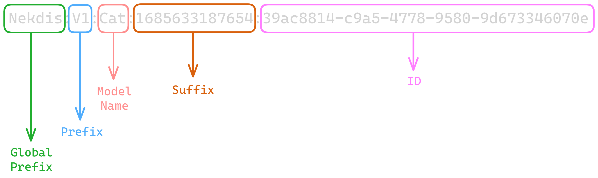

# Nekdis

## What is it?

Nekdis is the temporary name for a proposal for [redis-om](https://github.com/redis/redis-om-node) that aims to improve the user experience and performance by providing an ODM-like naming scheme like the famous library [mongoose](https://mongoosejs.com/) for MongoDB

## Future Plans

Right now the proposal includes almost every feature that redis-om already has (See: [Missing Features](#missing-features)) and introduces some like [References](#schema-types).

The next steps for the proposal include:
- Improve performance on parsing nested objects for hashes[^1]
- Improving auto fetch performance by including a lua script that will get injected as a redis function.
- Allow auto references to be updated.
- Improve reference checking
- Adding support for objects inside arrays.
- Make a proposal for [`node-redis`](https://github.com/redis/node-redis) to improve its performance.

# Table of contents

- [Nekdis](#nekdis)
  - [What is it?](#what-is-it)
  - [Future Plans](#future-plans)
- [Table of contents](#table-of-contents)
- [Installation](#installation)
- [Getting Started](#getting-started)
  - [Connecting to the database](#connecting-to-the-database)
  - [Creating a Schema](#creating-a-schema)
  - [Creating a Model](#creating-a-model)
  - [Creating and Saving data](#creating-and-saving-data)
- [The new `RecordId`](#the-new-recordid)
- [Vector Similarity Search](#vector-similarity-search)
  - [Pure queries](#pure-queries)
  - [Hybrid queries](#hybrid-queries)
  - [Range queries](#range-queries)
- [Custom Methods](#custom-methods)
- [Modules](#modules)
- [Schema Types](#schema-types)
- [Field Properties](#field-properties)
  - [Shared Properties](#shared-properties)
  - [Unique Properties](#unique-properties)
- [Missing features](#missing-features)
- [Todo](#todo)
- [Nekdis VS Redis-OM](#nekdis-vs-redis-om)
  - [Client](#client)
  - [Schema](#schema)
  - [Model vs Repository](#model-vs-repository)
    - [Nekdis Document](#nekdis-document)
      - [Creating and saving](#creating-and-saving)
      - [Creating and mutating](#creating-and-mutating)
  - [Search](#search)
  - [Nested objects](#nested-objects)
  - [A Simple example](#a-simple-example)
  - [Open Issues this proposal fixes](#open-issues-this-proposal-fixes)
  - [Benchmarks](#benchmarks)

# Installation

Nekdis is available on npm via the command

```sh
npm i nekdis
```

# Getting Started

## Connecting to the database

Nekdis already exports a global client but you can also create your own instance with the `Client` class.

```ts
import { client } from "nekdis";

client.connect().then(() => {
    console.log("Connected to redis");
});
```

<details>
<summary>Creating an instance</summary>

```ts
import { Client } from "nekdis";

const client = new Client();

client.connect().then(() => {
    console.log("Connected to redis");
});
```

</details>

## Creating a Schema

The client provides a helper to build a schema without any extra steps.

```ts
import { client } from "nekdis";

const catSchema = client.schema({
    name: { type: "string" }
});
```

## Creating a Model

The client also provides a helper to create a model.

```ts
import { client } from "nekdis";

const catModel = client.model("Cat", catSchema);
```

## Creating and Saving data

The model is what provides all the functions to manage your data on the database.

```ts
const aCat = catModel.createAndSave({
    name: "Nozomi"
});
```

# The new `RecordId`

This proposal introduces a new way to create unique ids called `RecordId`.

RecordIds allow you to set prefixes and other properties to your id that is shared across all of the records.



# Vector Similarity Search

There are 3 types of vss queries as said in the [documentation](https://redis.io/docs/stack/search/reference/vectors)

Lets use the following schema & model for the next examples

```ts
import { client } from "nekdis";

const testSchema = client.schema({
    age: "number",
    vec: "vector"
})

const testModel = client.model("Test", testSchema);
```

A note on the schema. Passing the string `"vector"` will default to the following options:
```js
const vectorDefaults = {
    ALGORITHM: "FLAT",
    // the vector type, nekdis calls it `vecType`
    TYPE: "FLOAT32",
    DIM: 128,
    // nekdis calls it `distance`
    DISTANCE_METRIC: "L2",
}
```

## Pure queries

```ts
testModel.search().where("vec").eq((vector) => vector
    .knn()
    .from([2, 5, 7])
    .return(8))
.returnAll();
// Generates the following query
// "*=>[KNN 8 @vec $BLOB]" PARAMS 2 BLOB \x02\x05\x07 DIALECT 2
```

## Hybrid queries

```ts
testModel.search().where("age").between(18, 30)
    .and("vec").eq((vector) => vector
        .knn()
        .from([2, 5, 7])
        .return(8))
    .returnAll();
// Generates the following query
// "((@age:[18 30]))=>[KNN 8 @vec $BLOB]" BLOB \x02\x05\x07 DIALECT 2
```

## Range queries

```ts
testModel.search().where("vec").eq((vector) => vector
    .range(5)
    .from([2, 5, 7]))
.returnAll();
// Generates the following query
// "((@vec:[VECTOR_RANGE 5 $BLOB]))" BLOB \x02\x05\x07 DIALECT 2
```

# Custom Methods

In this proposal you can create your own custom methods that will be added to the `Model`, this methods are defined on the schema directly.

> **WARNING:** Anonymous functions cannot be used when defining custom methods/functions

```ts
const albumSchema = client.schema({
    artist: { type: "string", required: true },
    name: { type: "text", required: true },
    year: "number"
}, {
    searchByName: async function (name: string) {
        return await this.search().where("name").matches(name).returnAll();
    }
})

const albumModel = client.model("Album", albumSchema);

const results = await albumModel.searchByName("DROP");
```

# Modules

Nekdis allows you to add modules to the client, modules are something that adds extra functionality to the library, you pass in a class where the constructor will receive the client as its first argument.

Keep in mind that this might be more useful if you are creating your own instance of the client and exporting it because that way you will also get intellisense for the module.

```ts
import {type Client, client} from "nekdis";

class MyModule {
    constructor(client: Client) {
        // Do something
    }

    myFunction() {
        // Do something
    }
}

client.withModules({ name: "myMod", ctor: MyModule });

// Access it
client.myMod.myFunction()
```

# Schema Types

This proposal adds 4 new data types `array`, `object`, `tuple` & `reference` and removes the `string[]` type.

| Type        | Description                                                                                                                                                                                                                                                                                                                                                                                 |
| ----------- | ------------------------------------------------------------------------------------------------------------------------------------------------------------------------------------------------------------------------------------------------------------------------------------------------------------------------------------------------------------------------------------------- |
| `string`    | A standard string that will be treated as `TAG`                                                                                                                                                                                                                                                                                                                                             |
| `number`    | A standard float64 number that will be treated as `NUMERIC`                                                                                                                                                                                                                                                                                                                                 |
| `boolean`   | A standard boolean that will be treated as `TAG`                                                                                                                                                                                                                                                                                                                                            |
| `text`      | A standard string that will be treated as `TEXT` which allows for full text search                                                                                                                                                                                                                                                                                                          |
| `date`      | This field will internally be treated as `NUMERIC`, it gets saved as a Unix Epoch but you will be able to interact with it normally as it will be a [`Date`](https://developer.mozilla.org/en-US/docs/Web/JavaScript/Reference/Global_Objects/Date) when you access it                                                                                                                      |
| `point`     | This is an object containing a `latitude` and `longitude` and will be treated as `GEO`                                                                                                                                                                                                                                                                                                      |
| `array`     | Internally it will be treated as the type given to the `elements` property which defaults to `string`                                                                                                                                                                                                                                                                                       |
| `object`    | This type allows you to nest forever using the `properties` property in the schema and what gets indexed are its properties, if none are given it will not be indexed not checked                                                                                                                                                                                                           |
| `reference` | When using this type you will be given a `ReferenceArray` which is a normal array with a `reference` method that you can pass in another document or a record id to it, references can be auto fetched but auto fetched references cannot be changed                                                                                                                                        |
| `tuple`     | Tuples will be presented as per-index type safe arrays but they are dealt with in a different way. They will be indexed as static props so you can search on a specific element only, this also affects the query builder instead of `where(arrayName)` it will be `where(arrayName.idx.prop)` but this has working intellisense just like all the other fields so it shouldn't be an issue |
| `vector`    | A vector field that is an array but treated as a `VECTOR`                                                                                                                                                                                                                                                                                                                                   |

# Field Properties

This proposal includes the addition of 2 new shared properties and some unique ones

## Shared Properties

| Property   | Description                                                                                                              |
| ---------- | ------------------------------------------------------------------------------------------------------------------------ |
| `type`     | The type of the field                                                                                                    |
| `optional` | Defines whether the field is optional or not (this doesn't work if validation is disabled)                               |
| `default`  | Chose a default value for the field making so that it will always exist even if it isn't required                        |
| `index`    | Defines whether the field should be indexed or not (defaults to `true`)                                                  |
| `sortable` | Defines whether the field is sortable or not (note that this doesn't exist nor work on object fields & reference fields) |

## Unique Properties

Vector properties wont be documented here, check the types instead

| Property     | Type        | Description                                                                                                                                                                  |
| ------------ | ----------- | ---------------------------------------------------------------------------------------------------------------------------------------------------------------------------- |
| `elements`   | `array`     | Defines the type of the array                                                                                                                                                |
| `elements`   | `tuple`     | Even tho it has the same name this field is required in tuples and there are no ways to define infinite length tuples (just use normal arrays)                               |
| `separator`  | `array`     | This defines the separator that will be used for arrays on hash fields                                                                                                       |
| `properties` | `object`    | The properties the object contains, if this isn't defined the object wont be type checked nor indexed                                                                        |
| `schema`     | `reference` | This is a required property when using references and it allows for intellisense to give the types on auto fetch and later on for certain type checking to also work as well |

# Missing features

- Stop Words.
- Case sensitive search fields.
- Word stemming.
- Field weight.
- Custom alias for a field[^3].
- Phonetic matcher

# Todo

- `in` operator for number search
- Array of points
- Fully support array of objects
- Add `$id` alias[^2]


[^1]: Currently the `deepMerge` function will take longer the more objects and nested objects you have, the idea i received is to do it all in one go by using a function to flatten it but im not sure yet on how to do it

[^2]: This could be a nice addition but im still unsure if this should be added and needs to be further discussed

[^3]: Is this really needed? From my point of view the complexity required to add this would outweigh any benefits from it specially on the type-level transformations

# Nekdis VS Redis-OM

In this part of the document im going to cover how this proposal compares to the current redis-om (0.4.2) and the major differences.

## Client

In Nekdis the `Client` does not provide any methods to interact directly with the database and its pretty much only used to store your models and handle the connection, **however** you can access the `node-redis` client by accessing `client.raw`.

## Schema

The schema in Nekdis is just where you define the shape of your data while in redis-om it also takes care of creating indexes and some other internal bits.

With this comes the big question "Well, why not use just a plain object then", the simple answer to this question is ease of use but to explain it further, having the schema defined this way allows the library to internally check if there isn't anything missing and parse it so you are allowed to use the shorthand methods like `field: "string"`, this approach also allows for you to define methods an options that will be passed down to the model down the road and not to mention that this is one of the only ways to have references working properly without affecting performance.

## Model vs Repository

In redis-om you use a `repository` to interact with the db by using methods like `fetch`, `save` and `search`.

In Nekdis the `model` is not that different but it allows you to add more functionality to it (see: [Custom Methods](#custom-methods)) and overall gives more functionality out of the box.

### Nekdis Document

In Nekdis you have what are called documents, this is just an abstraction to the data to allow better interaction with references and faster parsing.

At first this might look daunting compared to redis-om that now uses plain objects but i can assure you that there isn't that much of a difference, and i will give some examples to demonstrate it.

#### Creating and saving

See, its just as easy

<table>
<tr>
<th>Nekdis</th>
<th>Redis-OM</th>
</tr>
<tr>
<td>

```ts
await model.createAndSave({
    name: "DidaS"
});
```

</td>
<td>

```ts
await repository.save({
    name: "DidaS"
});
```

</td>
</tr>
</table>

#### Creating and mutating

This is where things start to be a bit different, even tho you **can** use a plain object that isn't recommended since it would just use more memory.

<table>
<tr>
<th>Nekdis</th>
<th>Nekdis with plain object</th>
<th>Redis-OM</th>
</tr>
<tr>
<td>

```ts
// You can pass values directly to it
// just like in createAndSave
const data = model.create({
    name: "DidaS"
});

// mutate data
data.year = 2023;

await model.save(data);
```

</td>
<td>

```ts
// Doing it this way will use more memory
// and you wont have intellisense
const data = {
    name: "DidaS"
}

// mutate data
data.year = 2023;

await model.createAndSave(data);
```

</td>
<td>

```ts
const data = {
    name: "DidaS"
}

// mutate data
data.year = 2023;

await repository.save(data);
```

</td>
</tr>
</table>

## Search

Looking at search for the first time it is pretty much the same, the only difference is that `equals` operations exist in **every** data type so a lot of times changing the data type in the schema wont break the query **and** the best part is that `eq`, `equals` and other operators like them support arrays (so they pretty much work like an `in` operator).

## Nested objects

Currently in redis-om you need to define a path for each field to define your nested objects, meanwhile in Nekdis they just work like normal js objects!

There are several advantages to this, two of the main ones being, faster serialization/deserialization and simpler to use, here is an example comparing both

<table>
<tr>
<th>Nekdis</th>
<th>Redis-OM</th>
</tr>
<tr>
<td>

```ts
client.schema({
    field: {
        type: "object",
        properties: {
            aNumberInsideOfIt: "number",
            nesting: {
                type: "object",
                properties: {
                    doubleNested: "boolean"
                }
            }
        }
    }
})
```

</td>
<td>

```ts
Schema("OM", {
    aNumberInsideOfIt: {
        type: "number",
        path: "$.field.aNumberInsideOfIt"
    },
    doubleNested: {
        type: "boolean",
        path: "$.field.nesting.doubleNested"
    }
})
```

</td>
</tr>
</table>

## A Simple example

This is a simple program example that generates 30 random users with random ages and fetches the ones matching a certain age just to show the differences between the libraries

<table>
<tr>
<th>Nekdis</th>
<th>Redis-OM</th>
</tr>
<tr>
<td>

```ts
// Import the global client
import { client } from "nekdis";

// Connect to the db
await client.connect();

// Create the schema
const userSchema = client.schema({
    age: "number"
}, {
    // Define function to help repetitive task
    findBetweenAge: async function (min: number, max: number) {
        return await this.search().where("age").between(min, max).returnAll();
    }
    // Add creation date to the key
}, { suffix: () => Date.now().toString() });

// Create the interface
const userModel = client.model("User", userSchema);

// Create the search index
await userModel.createIndex();

// Generate 30 users
for (let i = 0; i < 30; i++) {
    await userModel.createAndSave({
        age: between(18, 90)
    });
}

// Get the users that are between 30 and 50 years old
const users = await userModel.findBetweenAge(30, 50);

// Log the users
console.log(users)

// Close the connection
await client.disconnect();

// A helper function that generates a random number between min and max
function between(min: number, max: number) {
    return Math.round(Math.random() * (max - min + 1)) + min;
};
```

</td>
<td>

```ts
// Node stuff for the id
import { randomUUID } from "node:crypto";
// Import the redis client
import { createClient } from "redis";
// Import OM utilities
import { Schema, Repository, Entity, EntityId } from "redis-om";

// Create Client
const client = createClient()

// Connect to the db
await client.connect();

// Create the schema
const userSchema = new Schema("User", {
    age: { type: "number" }
});

// Create an interface to allow type safe manipulation
// However you will need to use it everywhere 
// If you are using js you would need to do it in jsdoc for it to work
interface UserEntity extends Entity {
    age: number
}

// Create the interface
const userRepository = new Repository(userSchema, client);

// Create the search index
await userRepository.createIndex();

// Generate 30 users
for (let i = 0; i < 30; i++) {
    await userRepository.save({
        // We set the "suffix" and random id to somewhat match Nekdis (still not 100% accurate you would need even more) 
        [EntityId]: `${Date.now()}:${randomUUID()}`,
        age: between(18, 90)
    });
}

// Get the users that are between 30 and 50 years old
const users = await findBetweenAge(userRepository, 30, 50);

// Log the users
console.log(users)

// Close the connection
await client.disconnect();

// Define function to help repetitive task
async function findBetweenAge(repository: Repository, min: number, max: number): Promise<Array<UserEntity>> {
    // Type assertion so ts does not complain
    return <Array<UserEntity>>await repository.search().where("age").between(min, max).returnAll();
}

// A helper function that generates a random number between min and max
function between(min: number, max: number) {
    return Math.round(Math.random() * (max - min + 1)) + min;
};
```

</td>
</tr>
</table>

## Open Issues this proposal fixes

- [#25 (Use reflection to do object mapping for a more declarative API)](https://github.com/redis/redis-om-node/issues/25)
  - Achieves this purely on the type level working for both js and ts without extra steps and without the declarative (decorators) part
- [#28 (Transactions & relations)](https://github.com/redis/redis-om-node/issues/28)
  - Relations are added and transactions are in the plans with a nice api like the c# lib
- [#44 (Add in (eq for multiple values))](https://github.com/redis/redis-om-node/issues/44)
  - As mentioned in [Search](#search) methods like `equals` work just like it
- [#54 (Add boolean[] as a new type)](https://github.com/redis/redis-om-node/issues/54)
- [#55 (Add number[] as a new type)](https://github.com/redis/redis-om-node/issues/55)
- [#66 (Implement implicit transaction and locking in the context of redis-om for master-detail relations )](https://github.com/redis/redis-om-node/issues/66)
  - Partially done with relations
- [#69 (Add default value to Schema)](https://github.com/redis/redis-om-node/issues/69)
  - Also `required` was added
- [#85 (Vector Similarity Search)](https://github.com/redis/redis-om-node/issues/85)
- [#120 (Add expireAt)](https://github.com/redis/redis-om-node/issues/120)
  - normal expire accepts both seconds or a date object
- [#141 (Feature: "in" query clause functionality)](https://github.com/redis/redis-om-node/issues/141)
  - Same as issue #44
- [#184 (Set a Global Prefix in Node Om)](https://github.com/redis/redis-om-node/issues/184)

## Benchmarks

There were a lot of benchmarks made and they can be found [here](./BENCHRESULTS.md)